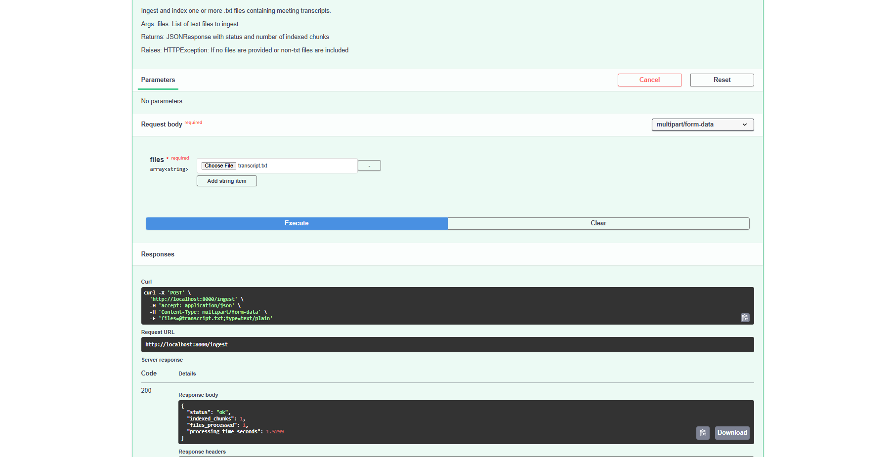
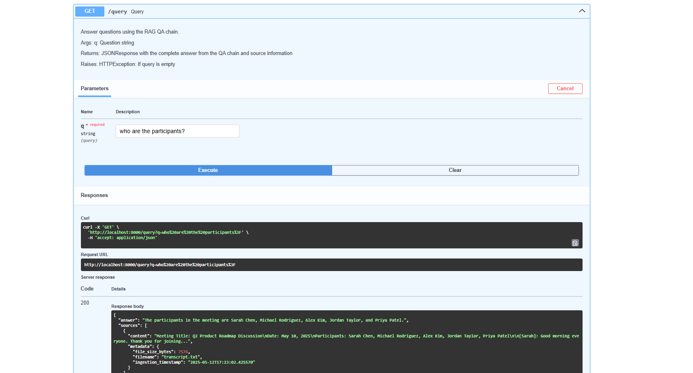

# Light-RAG: Lightweight Retrieval-Augmented Generation for Meeting Transcripts

## Overview

Light-RAG is a lightweight, production-ready Retrieval-Augmented Generation (RAG) system designed specifically for querying meeting transcripts. It provides accurate answers to questions about meeting content.

### Key Features

- **Modern RAG Architecture**: Uses LangChain's composable components for robust RAG capabilities
- **Fast Retrieval**: LanceDB vector database for efficient similarity search
- **Intelligent QA**: Enhanced prompting and context formatting for better answers
- **Source Attribution**: Answers include source information for transparency
- **Clean API**: FastAPI interface with proper documentation and error handling

## Technical Stack

- **Framework**: FastAPI
- **Vector Database**: LanceDB (local files)
- **Embeddings**: Cohere multilingual embeddings (embed-multilingual-v3.0) as default
- **LLM**: Groq (deepseek-r1-distill-llama-70b) as default
- **RAG Implementation**: LangChain QA Chain

## Installation

### Prerequisites

- Python 3.9+
- Cohere API key
- Groq API key

### Getting API Keys

#### Cohere API Key

1. Go to [Cohere's website](https://cohere.com/)
2. Sign up for a free account
3. Navigate to the [API keys section](https://dashboard.cohere.com/api-keys)
4. Create a new API key
5. Copy the key and save it securely

#### Groq API Key

1. Go to [Groq's website](https://console.groq.com/)
2. Create a free account
3. After signing in, go to the API keys section
4. Generate a new API key
5. Copy the key and save it securely

### Setup

```bash
# Clone the repository
git clone https://github.com/Jss-on/light-rag.git
cd light-rag

# Create virtual environment (optional but recommended)
python -m venv venv

# Activate virtual environment
# On Linux/macOS:
source venv/bin/activate
# On Windows:
venv\Scripts\activate

# Install dependencies
pip install -r requirements.txt

# Create .env file with your API keys

# On Linux/macOS:
cat > .env << EOL
COHERE_API_KEY=your_api_key
GROQ_API_KEY=your_api_key
EOL

# On Windows (PowerShell):
@"
COHERE_API_KEY=your_api_key
GROQ_API_KEY=your_api_key
"@ | Out-File -FilePath .env -Encoding utf8

# On Windows (Command Prompt):
# Create a file named .env and add the following lines:
# COHERE_API_KEY=your_api_key
# GROQ_API_KEY=your_api_key
```

## Usage

### Running the API Server

```bash
# Start the API server
uvicorn app:app --reload
```

The API will be available at http://localhost:8000

For interactive API documentation, visit http://localhost:8000/docs

### Docker Deployment

#### Prerequisites for Windows

- Install [Docker Desktop for Windows](https://www.docker.com/products/docker-desktop/)

The application can be easily deployed using Docker Compose:

#### Linux/macOS
```bash
# Build and start the container
docker-compose up -d

# View logs
docker-compose logs -f

# Stop the container
docker-compose down
```

#### Windows (Command Prompt or PowerShell)
```
# Build and start the container
docker-compose up -d

# View logs
docker-compose logs -f

# Stop the container
docker-compose down
```

#### Setting Environment Variables on Windows

##### Command Prompt
```cmd
:: Set API keys for the current session
set COHERE_API_KEY=your_key
set GROQ_API_KEY=your_key
docker-compose up -d
```

##### PowerShell
```powershell
# Set API keys for the current session
$env:COHERE_API_KEY = "your_key"
$env:GROQ_API_KEY = "your_key"
docker-compose up -d
```

#### Building Custom Docker Image

##### Linux/macOS
```bash
# Build the Docker image
docker build -t light-rag .

# Run the container
docker run -p 8000:8000 \
  -e COHERE_API_KEY=your_key \
  -e GROQ_API_KEY=your_key \
  -v $(pwd)/lancedb:/app/lancedb \
  light-rag
```

##### Windows (Command Prompt)
```cmd
:: Build the Docker image
docker build -t light-rag .

:: Run the container
docker run -p 8000:8000 ^
  -e COHERE_API_KEY=your_key ^
  -e GROQ_API_KEY=your_key ^
  -v %cd%\lancedb:/app/lancedb ^
  light-rag
```

##### Windows (PowerShell)
```powershell
# Build the Docker image
docker build -t light-rag .

# Run the container - use absolute path for the volume
docker run -p 8000:8000 `
  -e COHERE_API_KEY=your_key `
  -e GROQ_API_KEY=your_key `
  -v C:/Users/YOUR_USERNAME/path/to/light-rag/lancedb:/app/lancedb `
  light-rag

# Alternative (using direct path)
docker run -p 8000:8000 -e COHERE_API_KEY=your_key -e GROQ_API_KEY=your_key -v C:/path/to/light-rag/lancedb:/app/lancedb light-rag
```

### API Endpoints

#### 1. Ingest Meeting Transcripts

```bash
# Upload a meeting transcript
curl -X POST \
  http://localhost:8000/ingest \
  -F "files=@./data/transcript.txt"
```
sample screenshot:


#### 2. Query Meeting Content

```bash
# Ask a question about the meeting
curl "http://localhost:8000/query?q=Who%20were%20the%20participants%20in%20the%20meeting?"
```

Response format:
```json
{
  "answer": "The participants in the meeting were Sarah Chen, Michael Rodriguez, Alex Kim, Jordan Taylor, and Priya Patel.",
  "sources": [
    {
      "content": "Meeting Title: Q2 Product Roadmap Discussion
Date: May 10, 2025
Participants: Sarah Chen, Michael Rodriguez, Alex Kim, Jordan Taylor, Priya Patel...",
      "metadata": {
        "filename": "transcript.txt",
        "ingestion_timestamp": "2025-05-13T00:20:15.123456"
      }
    }
  ],
  "timestamp": "2025-05-13T00:21:30.987654",
  "query": "Who were the participants in the meeting?",
  "process_time_seconds": 1.234
}
```
sample screenshot:


#### 3. Health Check

```bash
# Check API status
curl http://localhost:8000/health
```

### Transcript Format

The system works with plain text meeting transcripts. For optimal results, include metadata like:

```
Meeting Title: [Title]
Date: [Date]
Participants: [Name1], [Name2], ...

[Speaker1]: [Text]
[Speaker2]: [Text]
...
```

### Development

The modular design makes it easy to extend the system:

1. Add new endpoints in the FastAPI application
2. Enhance the QA chain with additional components
3. Implement different retrieval strategies

### Production Considerations

- Add authentication for API endpoints
- Implement rate limiting and logging
- Consider hosting LanceDB on a persistent volume
- Add monitoring and metrics collection

## Limitations

- Currently optimized for text-based meeting transcripts
- LanceDB is a local file-based database
- No user authentication implemented in this version

## License

MIT
